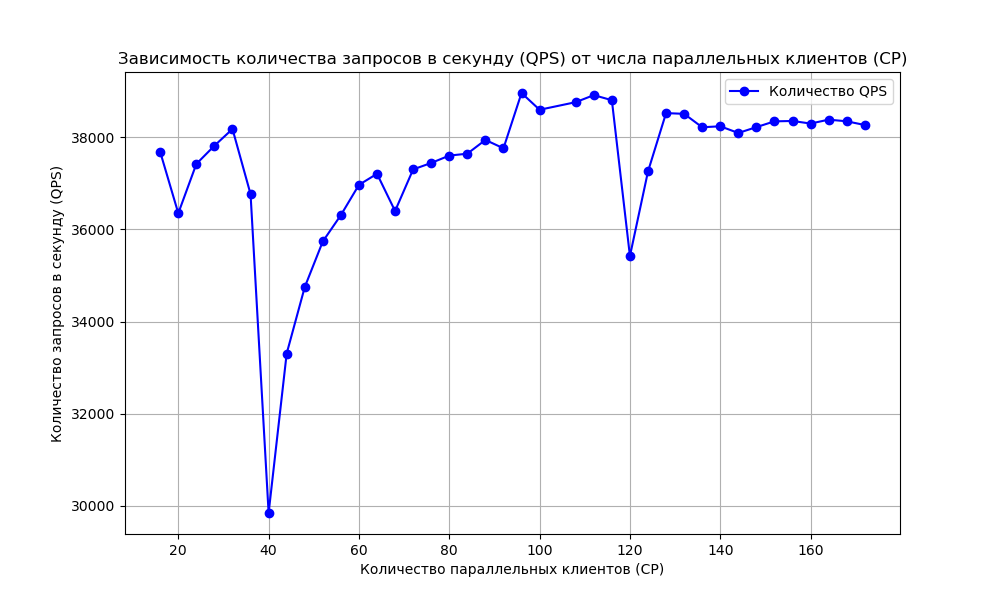
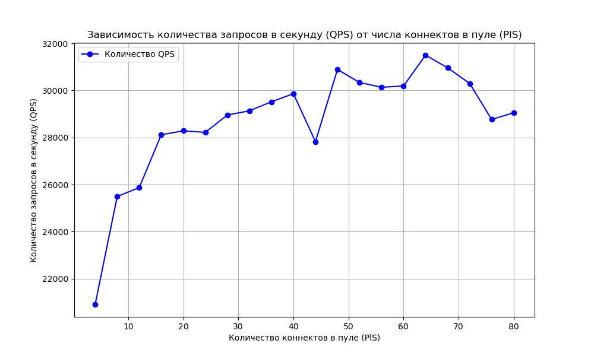

# spring_2025_Evstafev

## Load Testing
Использовал [Fortio](https://github.com/fortio/fortio?tab=readme-ov-file)

Добавил одно значение в таблицу перед тестированием. Будем ломиться в него GET запросами. 

Settings: 
- GET
- URL: http://localhost:8080/api/v1/get?customerId=1
- QPS: 100'000
- Duration: 20s
- Threads/Simultaneous connections: \{4, 40, 4\}
- Pool size: 64

В таблице представлены результаты НТ: qps от Threads для 2-ух реализаций.

Как видим наибольший qps при 96, но иметь более 32 нагружающих потоков нет большой необходимости, прирост незначительный.
qps для HashMap выше чем для PostgreSQL по ряду причин: 
1. Время доступа к данным в RAM меньше чем к буферному кэшу(и тем более к диску)
2. Накладные расходы на взаимодействие с базой данных(парсинг SQL, сетевое взаимодействие)
3. Внутренние процессы PostgreSQL(MVCC)

Протестируем зависимость qps от connection pool size для реализации с PostgreSQL.

Settings: 
- GET
- URL: http://localhost:8080/api/v1/get?customerId=1
- QPS: 100'000
- Duration: 20s
- Threads/Simultaneous connections: 32

В таблице представлены результаты НТ: qps от connection pool size для реализации с PostgreSQL.

Оптимальное значение connection pool size = 64. Данные об утилизации сохранены в файлах cpu_usage_*
